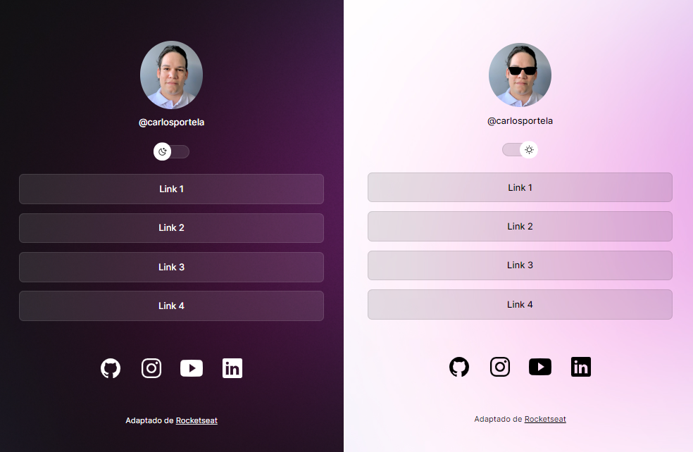

<h1 align="center"> Agregador de Links - Baseado no projeto "Dev Links" da Rocketseat</h1>

  

## Tecnologias Usadas no Projeto

- HTML e CSS
- JavaScript
- Figma

## Implementação

 Foi implementado um agregador de links, contendo um profile (foto de perfil e @) e duas listas contendo links.
- A primeira lista com links de 1 a 4 não levam a um caminho específico, estando ali apenas para compor o layout.
- A segunda lista,na parte inferior, leva para páginas iniciais das principais redes sociais.
- Apresenta um botão de mudança de estilo que alterna entre "Dark Mode" e "Light Mode". 

## Licença

Esse projeto foi adaptado a partir do modelo apresentado no curso "DevLinks" da Rocketseat. Instrutor: Mayk Brito